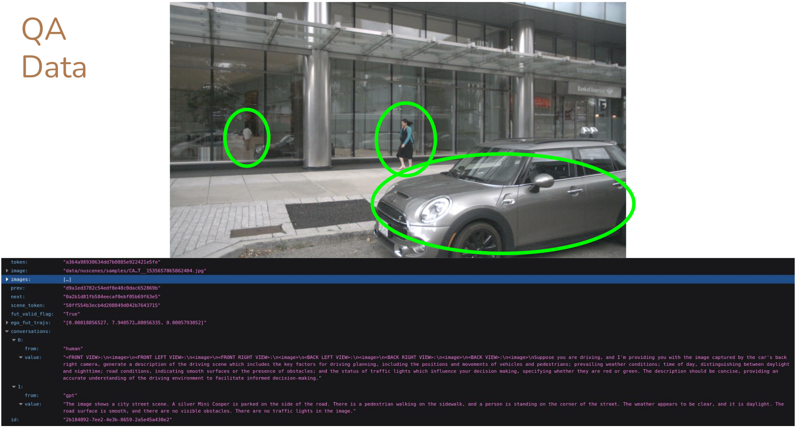

# VLAD
```VLAD: A VLM-Augmented Autonomous Driving Framework with Hierarchical Planning and Interpretable Decision Process.```

## Question-Answer Dataset examples (nuScenes)
The QA Dataset is generated offline with an automatic pipeline and the states of the environment are retrieved from ground-truth labels. This way, we can fine-tune VLAD on accurate data, ensuring the quality of its output when validating its high-level planning abilities and explainability capabilities within nuScenes dataset.

### Perception
We prompt the model to provide scene descriptions for each camera and detect if there are other agents (with a particular focus on pedestrians and cyclists). Moreover, we ask the model to detect if there are any traffic lights, along with their state.

Example 1


Example 2


Example 3


### Prediction
For each detected actor, we prompt the model to predict their future motions for the next few seconds (the prediction is a high-level command).


### Planning

Based on the perceived and forecasted environment, we query the model to provide a high-level command that will guide the ego vehicle for the next few seconds, along with an explanation.


## Question-Answer Dataset examples (CARLA)
We have also designed the same automatic pipeline to generate QA data within CARLA simulator. This way, we can test the generalization capabilities of our framework and at the same time we prepare an environment for closed-loop evaluations we plan to do in the near future.

### Perception


### Prediction


### Planning

